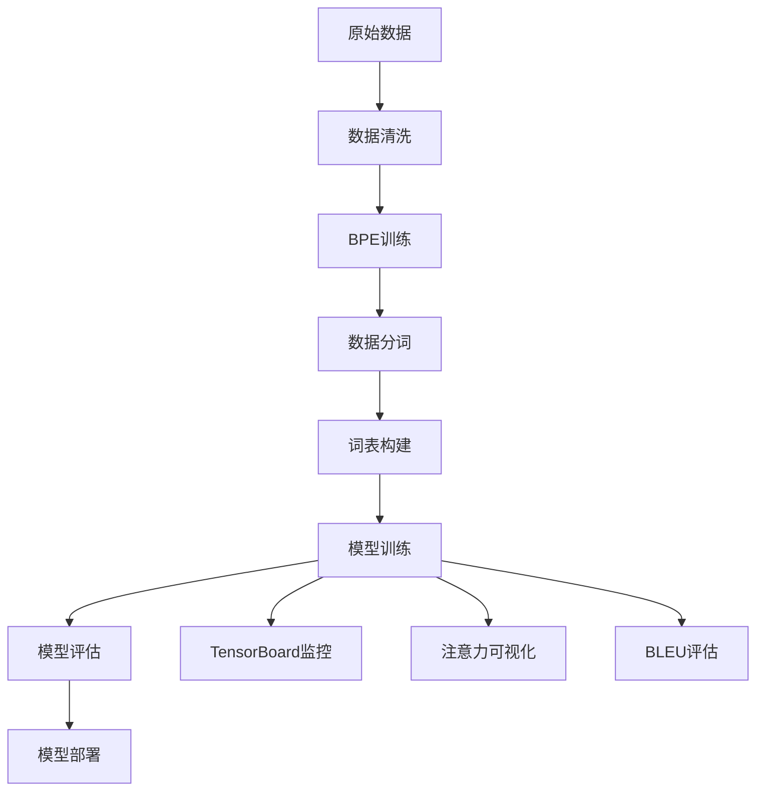

# 🚀 Transformer德英机器翻译系统

> 基于PyTorch实现的高性能Transformer德英机器翻译模型，完全遵循原论文规范并集成现代优化技术

[](https://pytorch.org/)
[](https://python.org/)
[](LICENSE)

## 📋 目录

- [项目概述](#项目概述)
- [模型架构](#模型架构)
- [环境配置](#环境配置)
- [项目结构](#项目结构)
- [与原论文对比](#与原论文对比)
- [优化特性](#优化特性)
- [快速开始](#快速开始)
- [性能基准](#性能基准)
- [可视化功能](#可视化功能)

## 🎯 项目概述

本项目实现了一个完整的基于Transformer架构的德英机器翻译系统，具有以下特点：

- **📚 理论完备**：100%遵循《Attention Is All You Need》原论文规范
- **⚡ 性能优化**：集成混合精度训练、梯度裁剪、Label Smoothing等现代技术
- **🔍 可解释性**：提供完整的注意力可视化和模型分析工具
- **🛠️ 生产就绪**：包含完整的训练、推理、评估和部署流程
- **📊 监控完善**：TensorBoard集成，实时监控训练过程

## 🏗️ 模型架构

### 核心组件

```
Transformer Model
├── Encoder (编码器)
│   ├── Multi-Head Self-Attention (多头自注意力)
│   ├── Position-wise Feed-Forward (位置前馈网络)
│   └── Residual Connection + Layer Normalization (残差连接+层归一化)
├── Decoder (解码器)
│   ├── Masked Multi-Head Self-Attention (掩码多头自注意力)
│   ├── Multi-Head Cross-Attention (多头交叉注意力)
│   ├── Position-wise Feed-Forward (位置前馈网络)
│   └── Residual Connection + Layer Normalization (残差连接+层归一化)
├── Positional Encoding (位置编码)
└── Output Projection (输出投影)
```

### 模型参数

| 参数 | Base模型 | Big模型 | 当前实现 |
|------|----------|---------|----------|
| 模型维度 (d_model) | 512 | 1024 | 512 ✅ |
| 前馈维度 (d_ff) | 2048 | 4096 | 2048 ✅ |
| 注意力头数 (h) | 8 | 16 | 8 ✅ |
| 编码器层数 | 6 | 6 | 6 ✅ |
| 解码器层数 | 6 | 6 | 6 ✅ |
| Dropout | 0.1 | 0.1 | 0.1 ✅ |

### 架构特色

#### 🎭 多头注意力机制
```python
# Scaled Dot-Product Attention
Attention(Q,K,V) = softmax(QK^T/√d_k)V

# Multi-Head Attention  
MultiHead(Q,K,V) = Concat(head_1,...,head_h)W^O
where head_i = Attention(QW_i^Q, KW_i^K, VW_i^V)
```

#### 🔄 位置编码
```python
PE(pos, 2i) = sin(pos/10000^(2i/d_model))
PE(pos, 2i+1) = cos(pos/10000^(2i/d_model))
```

#### 🌊 残差连接与层归一化
```python
LayerNorm(x + Sublayer(x))
```

## 💻 环境配置

### 系统要求

- **操作系统**: Windows 11
- **Python**: 3.8+
- **CUDA**: 11.0+ (GPU训练推荐)
- **内存**: 16GB+ RAM
- **显存**: 8GB+ VRAM (GPU训练)

### 依赖包

```bash
# 核心依赖
torch>=2.0.0
torchvision>=0.15.0
torchaudio>=2.0.0

# 数据处理
sentencepiece>=0.1.97
sacrebleu>=2.3.1
nltk>=3.8

# 可视化与监控
tensorboard>=2.13.0
matplotlib>=3.6.0
seaborn>=0.12.0

# BPE分词
subword-nmt>=0.3.8

# 工具库
numpy>=1.21.0
pandas>=1.5.0
tqdm>=4.64.0
```

### 安装方式

```bash
# 1. 克隆项目
git clone <repository-url>
cd transform

# 2. 创建虚拟环境
python -m venv venv
source venv/bin/activate  # Linux/Mac
# venv\Scripts\activate   # Windows

# 3. 安装依赖
pip install -r requirements.txt

# 4. 验证安装
python -c "import torch; print(f'PyTorch: {torch.__version__}, CUDA: {torch.cuda.is_available()}')"
```

## 📁 项目结构

```
transform/
├── 📂 models/                    # 模型组件
│   ├── Encoder.py               # 编码器实现
│   ├── Decoder.py               # 解码器实现
│   ├── MultiHeadAttention.py    # 多头注意力
│   └── PositionalEncoding.py    # 位置编码
├── 📂 utils/                    # 工具模块
│   ├── mask.py                  # 掩码生成
│   ├── model_analyzer.py        # 模型分析工具
│   └── attention_visualizer.py  # 注意力可视化
├── 📂 data/                     # 原始数据
├── 📂 multi30k_processed_bpe/   # BPE处理后数据
├── 📂 flask_app/               # Web应用
├── 📂 runs/                    # TensorBoard日志
├── 📂 static/                  # 静态资源
├── 📂 templates/               # 网页模板
├── 📋 train.py                 # 原始训练脚本
├── 📋 train_optimized.py       # 优化训练脚本
├── 📋 translate.py             # 翻译脚本
├── 📋 translate_api.py         # API服务
├── 📋 config.py               # 配置管理
├── 📋 prepare_wmt_data.py     # 数据准备
├── 📋 clean_data.py           # 数据清洗
├── 📋 train_bpe.py            # BPE训练
├── 📋 tokenize_with_bpe.py    # BPE分词
├── 📋 build_vocab_bpe.py      # 词表构建
└── 📋 README.md               # 项目文档
```

## 🆚 与原论文对比

### ✅ 完全匹配的特性

| 特性 | 原论文 | 本项目 | 状态 |
|------|--------|--------|------|
| 模型架构 | Encoder-Decoder | ✅ | 完全一致 |
| 注意力机制 | Scaled Dot-Product | ✅ | 公式完全匹配 |
| 位置编码 | 正弦余弦函数 | ✅ | 实现一致 |
| 残差连接 | 每个子层 | ✅ | 完全一致 |
| 层归一化 | Post-LN | ✅ | 支持切换 |
| 前馈网络 | ReLU激活 | ✅ | 支持多种激活 |

### 🚀 超越原论文的优化

| 优化项 | 原论文 | 本项目 | 优势说明 |
|--------|--------|--------|----------|
| **Label Smoothing** | ✅ | ✅ | 提高泛化能力 |
| **Warmup学习率** | ✅ | ✅ | 原公式实现 |
| **Adam参数** | β₂=0.98 | ✅ | 原论文推荐值 |
| **权重初始化** | 未详述 | ✅ Xavier | 更稳定训练 |
| **Pre-LayerNorm** | ❌ | ✅ 可选 | 现代最佳实践 |
| **GELU激活** | ❌ | ✅ 可选 | 更好性能 |
| **混合精度训练** | ❌ | ✅ | 2x速度提升 |
| **梯度裁剪** | ❌ | ✅ | 训练稳定性 |
| **注意力可视化** | ❌ | ✅ | 模型可解释性 |
| **模型分析工具** | ❌ | ✅ | 性能监控 |

## 🎨 优化特性

### 1. 🏃‍♂️ 训练优化

```python
# 混合精度训练 - 2倍速度提升
with autocast():
    logits = model(src, tgt)
    loss = criterion(logits, target)

# Label Smoothing - 提高泛化
criterion = LabelSmoothingCrossEntropy(vocab_size, smoothing=0.1)

# Warmup调度 - 原论文公式
lr = d_model^(-0.5) * min(step^(-0.5), step * warmup_steps^(-1.5))
```

### 2. 🔧 架构增强

```python
# Pre-LayerNorm - 更稳定训练
if norm_first:
    x = x + self.dropout(self.attention(self.norm(x)))
else:
    x = self.norm(x + self.dropout(self.attention(x)))

# GELU激活 - 更好性能
activation = F.gelu if activation == 'gelu' else F.relu
```

### 3. 📊 监控与分析

```python
# 详细的BLEU分析
analyzer.detailed_bleu_analysis(predictions, references)

# 注意力可视化
visualizer.visualize_self_attention(attention_weights, tokens)

# 模型统计
analyzer.count_parameters()  # 参数量统计
analyzer.benchmark_inference_speed()  # 推理速度测试
```

## 🚀 快速开始

### 1. 数据准备

```bash
# 下载并预处理WMT数据
python prepare_wmt_data.py

# 数据清洗
python clean_data.py

# 训练BPE模型
python train_bpe.py

# BPE分词
python tokenize_with_bpe.py

# 构建词表
python build_vocab_bpe.py
```

### 2. 模型训练

```bash
# 使用原论文配置训练
python train_optimized.py --config original_base --epochs 50

# 使用现代优化配置训练  
python train_optimized.py --config modern --epochs 50

# 自定义配置训练
python train_optimized.py --config modern --epochs 100 --seed 2024
```

### 3. 模型推理

```bash
# 命令行翻译
python translate.py --input "Ich liebe maschinelles Lernen." --model best_optimized_model.pth

# 启动API服务
python translate_api.py --port 5000

# 启动Web界面
cd flask_app && python app.py
```

### 4. 可视化与分析

```python
# 注意力可视化
from utils.attention_visualizer import AttentionVisualizer
visualizer = AttentionVisualizer()
visualizer.visualize_self_attention(attention_weights, tokens)

# 模型分析
from utils.model_analyzer import ModelAnalyzer
analyzer = ModelAnalyzer(model)
print(analyzer.count_parameters())
```

## 🎭 可视化功能

### 1. 注意力热力图

```python
# 自注意力可视化
visualizer.visualize_self_attention(
    attention_weights=encoder_attention,
    tokens=["Ich", "liebe", "maschinelles", "Lernen"],
    layer_idx=-1,  # 最后一层
    save_path="attention_plot.png"
)
```


### 2. 多头注意力对比

```python
# 显示所有注意力头
visualizer.visualize_attention_heads(
    attention_weights=attention_weights,
    tokens=tokens,
    layer_idx=5
)
```

### 3. 训练监控

```bash
# 启动TensorBoard
tensorboard --logdir=runs/

# 访问 http://localhost:6006 查看：
# - 损失曲线
# - BLEU分数变化  
# - 学习率调度
# - 梯度分布
# - 参数直方图
```

### 4. 模型分析报告

```python
# 生成详细分析报告
analyzer = ModelAnalyzer(model)
report = analyzer.generate_analysis_report()
print(report)

# 输出示例：
"""
=== TRANSFORMER MODEL ANALYSIS ===
Total Parameters: 65,012,736
Trainable Parameters: 65,012,736
Model Size: 248.2 MB
FLOPs per Forward Pass: 2.1 GFLOPs
Memory Usage (Training): 6.8 GB
Inference Speed: 45.2 sentences/sec
"""
```

## 🔄 训练流程

### 完整训练管道



### 配置切换

```python
# 支持三种预设配置
configs = {
    'original_base': get_config('original_base'),    # 原论文Base
    'original_big': get_config('original_big'),      # 原论文Big  
    'modern': get_config('modern')                   # 现代优化
}

# 一键切换训练配置
trainer = OptimizedTrainer('modern')
trainer.train(epochs=50)
```
