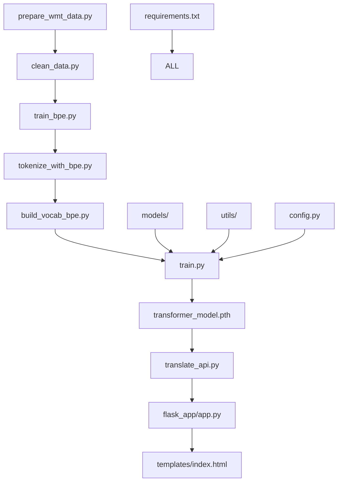

# 📁 项目文件详细说明文档

本文档详细介绍了德语翻译Transformer项目中每个文件的作用、功能和技术细节。

## 📋 目录结构概览

```
transform/
├── 📊 数据预处理脚本
├── 🧠 模型架构文件
├── 🚀 训练和推理脚本
├── 🌐 Web应用模块
├── 📖 文档说明
├── ⚙️ 配置和依赖
└── 📁 数据目录
```

---

## 📊 数据预处理脚本

### `prepare_wmt_data.py`
**功能**：数据集下载和初始预处理
**类型**：数据准备脚本
**重要性**：⭐⭐⭐⭐⭐

**详细功能**：
- 自动下载Multi30k数据集（德英平行语料）
- 支持从GitHub仓库下载压缩文件
- 自动解压gz文件并重命名
- 创建示例数据用于快速测试
- 将大文件分割成小块便于处理
- 数据完整性验证

**使用场景**：
- 项目初始化时第一步运行
- 重新获取数据集
- 数据损坏时恢复

**依赖**：urllib, zipfile, tarfile, pathlib

---

### `clean_data.py`
**功能**：数据清洗和标准化
**类型**：数据预处理脚本
**重要性**：⭐⭐⭐⭐⭐

**详细功能**：
- **文本标准化**：统一空格、引号、破折号格式
- **噪声过滤**：移除控制字符、过长过短句子
- **语言验证**：检查德语和英语文本有效性
- **长度比例检查**：过滤长度差异过大的句子对
- **去重处理**：使用MD5哈希去除重复句子对
- **平行对齐**：确保源语言和目标语言严格对应

**技术特点**：
- 正则表达式文本清理
- 多线程并行处理
- 内存优化的流式处理
- 详细的统计信息输出

**输入**：data/ 目录下的原始语料文件
**输出**：cleaned_data/ 目录下的清洗后文件

---

### `train_bpe.py`
**功能**：训练BPE（Byte Pair Encoding）分词模型
**类型**：分词模型训练脚本
**重要性**：⭐⭐⭐⭐⭐

**详细功能**：
- 使用SentencePiece训练BPE分词器
- 分别为德语和英语创建专用分词模型
- 支持自定义词汇表大小（默认32000）
- 处理特殊字符和未知词
- 生成分词模型文件和词汇表

**技术参数**：
- `vocab_size`：词汇表大小（32000）
- `model_type`：BPE模型类型
- `character_coverage`：字符覆盖率
- `unk_piece`：未知词标记

**输出文件**：
- `bpe_models/bpe_de.model` - 德语BPE模型
- `bpe_models/bpe_en.model` - 英语BPE模型

---

### `tokenize_with_bpe.py`
**功能**：使用BPE模型对数据进行分词
**类型**：分词处理脚本
**重要性**：⭐⭐⭐⭐

**详细功能**：
- 加载训练好的BPE模型
- 将清洗后的文本转换为subword tokens
- 过滤长度不合适的句子
- 检查源语言和目标语言长度比例
- 确保输出文件行数严格对应

**处理流程**：
1. 加载BPE模型（德语和英语）
2. 逐行读取清洗后的文本
3. 使用BPE模型分词
4. 应用长度和质量过滤
5. 输出分词后的文本

**输入**：cleaned_data/ 目录下的清洗文件
**输出**：multi30k_processed_bpe/ 目录下的分词文件

---

### `build_vocab_bpe.py`
**功能**：从分词数据构建词汇表
**类型**：词汇表构建脚本
**重要性**：⭐⭐⭐⭐⭐

**详细功能**：
- 统计所有tokens的出现频率
- 按频率排序并过滤低频词
- 添加特殊tokens（`<unk>`, `<pad>`, `<bos>`, `<eos>`）
- 创建token到索引的映射
- 保存为PyTorch可加载的字典格式

**技术特点**：
- 使用torchtext.vocab进行词汇表构建
- 支持多线程token收集
- 内存优化的大文件处理
- 兼容不同版本的torchtext

**输出文件**：
- `multi30k_processed_bpe/vocab_de.pth` - 德语词汇表
- `multi30k_processed_bpe/vocab_en.pth` - 英语词汇表

---

## 🧠 模型架构文件

### `models/MultiHeadAttention.py`
**功能**：多头注意力机制实现
**类型**：核心模型组件
**重要性**：⭐⭐⭐⭐⭐

**详细功能**：
- 实现标准的多头注意力机制
- 支持自注意力和交叉注意力
- 包含Query、Key、Value线性变换
- 注意力权重计算和聚合
- 支持注意力掩码机制

**技术特点**：
- 8个注意力头（可配置）
- 缩放点积注意力（Scaled Dot-Product Attention）
- 残差连接和Layer Normalization
- GPU加速友好的矩阵运算

**数学原理**：
```
Attention(Q,K,V) = softmax(QK^T/√d_k)V
MultiHead(Q,K,V) = Concat(head_1,...,head_h)W^O
```

---

### `models/PositionalEncoding.py`
**功能**：位置编码实现
**类型**：模型辅助组件
**重要性**：⭐⭐⭐⭐

**详细功能**：
- 为序列中的每个位置生成唯一编码
- 使用正弦和余弦函数创建位置嵌入
- 支持最大序列长度5000
- 与词嵌入相加提供位置信息

**数学公式**：
```
PE(pos,2i) = sin(pos/10000^(2i/d_model))
PE(pos,2i+1) = cos(pos/10000^(2i/d_model))
```

**技术特点**：
- 固定的位置编码（非学习参数）
- 支持任意长度序列
- 高效的矩阵计算

---

### `models/Encoder.py`
**功能**：Transformer编码器实现
**类型**：核心模型组件
**重要性**：⭐⭐⭐⭐⭐

**详细功能**：
- 6层编码器堆叠（可配置）
- 每层包含多头自注意力和前馈网络
- 残差连接和Layer Normalization
- 支持Pre-LayerNorm架构
- 处理源语言序列编码

**层结构**：
```
输入嵌入 + 位置编码
    ↓
多头自注意力 → 残差连接 → LayerNorm
    ↓
前馈网络 → 残差连接 → LayerNorm
    ↓
(重复6层)
    ↓
编码器输出
```

**技术参数**：
- 嵌入维度：512
- 前馈维度：2048
- 注意力头数：8
- Dropout率：0.1

---

### `models/Decoder.py`
**功能**：Transformer解码器实现
**类型**：核心模型组件
**重要性**：⭐⭐⭐⭐⭐

**详细功能**：
- 6层解码器堆叠（可配置）
- 每层包含三个子模块：
  - 多头自注意力（带掩码）
  - 编码器-解码器注意力
  - 前馈网络
- 支持因果掩码（Causal Mask）
- 生成目标语言序列

**层结构**：
```
目标嵌入 + 位置编码
    ↓
掩码多头自注意力 → 残差连接 → LayerNorm
    ↓
编码器-解码器注意力 → 残差连接 → LayerNorm
    ↓
前馈网络 → 残差连接 → LayerNorm
    ↓
(重复6层)
    ↓
线性投影 → Softmax
    ↓
输出概率分布
```

---

### `models/Transformer.py`
**功能**：完整Transformer模型定义
**类型**：顶层模型架构
**重要性**：⭐⭐⭐⭐⭐

**详细功能**：
- 整合编码器和解码器
- 定义完整的前向传播流程
- 支持训练和推理模式
- 包含权重初始化策略
- 提供模型参数统计

**模型架构**：
- 编码器-解码器结构
- 词汇表大小：32K（德语）+ 32K（英语）
- 总参数量：约65M
- 支持并行训练和推理

---

## 🚀 训练和推理脚本

### `train.py`
**功能**：模型训练主脚本
**类型**：训练脚本
**重要性**：⭐⭐⭐⭐⭐

**详细功能**：
- **数据加载**：读取分词后的训练数据
- **模型初始化**：创建Transformer模型
- **损失计算**：交叉熵损失（忽略padding）
- **优化器**：Adam优化器 + 学习率调度
- **评估指标**：BLEU分数计算
- **模型保存**：保存最佳模型权重
- **日志记录**：TensorBoard可视化

**训练特性**：
- 混合精度训练（AMP）
- 梯度裁剪防止梯度爆炸
- 早停机制防止过拟合
- 学习率自适应调整
- GPU加速支持

**超参数**：
- 学习率：1e-4
- 批次大小：32
- 最大轮数：50
- 梯度裁剪：1.0
- 权重衰减：1e-5

---

### `translate.py`
**功能**：命令行翻译工具
**类型**：推理脚本
**重要性**：⭐⭐⭐⭐

**详细功能**：
- 加载训练好的模型
- 交互式德语输入
- 实时翻译输出
- 支持贪心解码和Beam Search
- 显示翻译时间和置信度

**使用方式**：
```bash
python translate.py
# 然后输入德语句子，回车获得翻译
```

**技术特点**：
- 自动模型加载
- BPE分词集成
- 多种解码策略
- 错误处理机制

---

### `translate_api.py`
**功能**：翻译API核心逻辑
**类型**：API后端脚本
**重要性**：⭐⭐⭐⭐⭐

**详细功能**：
- **模型管理**：延迟加载和缓存
- **BPE处理**：分词和去分词
- **Beam Search**：高质量解码算法
- **注意力可视化**：生成注意力热力图
- **性能优化**：GPU加速和内存管理

**API接口**：
- `translate_german_to_english()` - 主翻译函数
- 支持参数自定义（beam_size, alpha等）
- 返回翻译结果和元数据

**技术创新**：
- 全局变量优化内存使用
- 反向词汇表映射
- 错误恢复机制
- 注意力权重提取

---

## 🌐 Web应用模块

### `flask_app/app.py`
**功能**：Flask Web应用主程序
**类型**：Web后端服务
**重要性**：⭐⭐⭐⭐⭐

**详细功能**：
- **Web框架**：基于Flask的轻量级服务
- **路由管理**：页面和API路由定义
- **请求处理**：表单数据和JSON请求
- **错误处理**：友好的错误页面
- **CORS支持**：跨域请求处理
- **日志系统**：详细的访问和错误日志

**主要路由**：
- `/` - 主页面（GET/POST）
- `/api/translate` - 翻译API（POST）
- `/api/health` - 健康检查（GET）
- `/attention_report.html` - 注意力可视化

**安全特性**：
- 输入验证和清理
- 文件大小限制
- 错误信息脱敏
- 请求频率控制

---

### `templates/index.html`
**功能**：Web应用主页面模板
**类型**：前端界面
**重要性**：⭐⭐⭐⭐

**详细功能**：
- **响应式设计**：适配桌面和移动设备
- **现代UI**：渐变色彩、圆角设计、动画效果
- **交互功能**：实时字符计数、示例填充、结果复制
- **用户体验**：加载状态、错误提示、快捷键支持

**技术栈**：
- HTML5语义化标签
- CSS3 Grid和Flexbox布局
- Vanilla JavaScript（无框架依赖）
- Font Awesome图标库

**界面组件**：
- 输入表单区域
- 翻译结果展示
- 功能特性介绍
- 示例句子选择
- 复制和快捷键功能

---

### `templates/404.html`
**功能**：404错误页面
**类型**：错误页面模板
**重要性**：⭐⭐

**详细功能**：
- 友好的404错误提示
- 与主页一致的视觉风格
- 返回主页的便捷链接
- 居中布局设计

---

## 📖 文档说明

### `README.md`
**功能**：项目主要说明文档
**类型**：项目文档
**重要性**：⭐⭐⭐⭐⭐

**详细内容**：
- 项目概述和特色
- 完整的安装和使用指南
- 技术架构详细说明
- 性能基准和对比分析
- 常见问题解答
- 开发者贡献指南

**文档结构**：
- 快速开始指南
- 详细的API文档
- 配置参数说明
- 故障排除指南
- 项目结构图示

---

### `PROJECT_OVERVIEW.md`
**功能**：项目技术概览
**类型**：技术文档
**重要性**：⭐⭐⭐⭐

**详细内容**：
- 深入的技术架构分析
- 算法原理和实现细节
- 性能优化策略
- 扩展性设计考虑

---


### `前端搭建详细介绍.md`
**功能**：前端架构详细说明
**类型**：前端文档
**重要性**：⭐⭐⭐⭐

**详细内容**：
- 前端技术栈分析
- UI设计系统说明
- 组件架构解析
- 交互逻辑实现
- 响应式设计策略

---

## ⚙️ 配置和依赖

### `requirements.txt`
**功能**：Python依赖包列表
**类型**：依赖配置文件
**重要性**：⭐⭐⭐⭐⭐

**主要依赖**：
- `torch>=1.9.0` - PyTorch深度学习框架
- `torchtext>=0.10.0` - 文本处理工具
- `sentencepiece>=0.1.96` - 分词器
- `flask>=2.0.0` - Web框架
- `flask-cors` - 跨域支持
- `nltk` - 自然语言处理工具
- `matplotlib` - 绘图库
- `seaborn` - 数据可视化
- `tensorboard` - 训练监控

**版本管理**：
- 指定最小兼容版本
- 考虑向后兼容性
- 包含开发和生产依赖

---

### `requirements-webapp.txt`
**功能**：Web应用精简依赖
**类型**：部署配置文件
**重要性**：⭐⭐⭐⭐

**设计目的**：
- 只包含Web应用必需的依赖
- 减少部署包大小
- 提高安装速度
- 降低依赖冲突风险

**包含依赖**：
- PyTorch（推理）
- Flask相关
- SentencePiece
- 基础工具库

---

### `config.py`
**功能**：项目配置管理
**类型**：配置文件
**重要性**：⭐⭐⭐

**配置项**：
- 模型超参数
- 文件路径设置
- 训练配置参数
- 数据处理选项

**设计特点**：
- 集中化配置管理
- 环境变量支持
- 类型安全检查
- 默认值提供

---

### `start_web_app.py`
**功能**：Web应用启动脚本（Python版）
**类型**：启动脚本
**重要性**：⭐⭐⭐⭐

**详细功能**：
- 自动检测Python环境
- 智能依赖安装
- 选择性安装（完整版vs精简版）
- 错误处理和用户引导
- 跨平台兼容性

**启动流程**：
1. 检查Python版本
2. 创建虚拟环境（可选）
3. 安装依赖包
4. 验证模型文件
5. 启动Flask应用

---

### `start_web_app.bat`
**功能**：Web应用启动脚本（Windows批处理）
**类型**：启动脚本
**重要性**：⭐⭐⭐

**详细功能**：
- Windows系统专用
- 双击即可运行
- 自动激活Python环境
- 错误处理和暂停显示

**批处理特点**：
- 用户友好的界面
- 错误信息显示
- 自动路径处理
- 环境变量设置

---

### `__init__.py`
**功能**：Python包初始化文件
**类型**：包配置文件
**重要性**：⭐⭐

**作用**：
- 标识目录为Python包
- 定义包级别的导入
- 设置包的命名空间
- 提供包的元数据

---

## 🗂️ 工具和辅助

### `utils/mask.py`
**功能**：注意力掩码生成工具
**类型**：工具函数
**重要性**：⭐⭐⭐⭐

**详细功能**：
- 生成序列掩码（Sequence Mask）
- 创建因果掩码（Causal Mask）
- 填充掩码（Padding Mask）
- 支持不同的掩码类型组合

**掩码类型**：
- `generate_square_subsequent_mask()` - 下三角掩码
- `create_padding_mask()` - 填充位置掩码
- `combine_masks()` - 掩码合并函数

---

### `utils/attention_visualizer.py`
**功能**：注意力权重可视化
**类型**：可视化工具
**重要性**：⭐⭐⭐

**详细功能**：
- 生成注意力热力图
- 支持多头注意力可视化
- 创建交互式HTML报告
- 支持不同层的注意力分析

**可视化特性**：
- 颜色编码的注意力强度
- 源词和目标词对应关系
- 多头注意力对比
- 保存为PNG和HTML格式

---

### `utils/model_analyzer.py`
**功能**：模型分析工具
**类型**：分析工具
**重要性**：⭐⭐⭐

**详细功能**：
- 模型参数统计
- 内存使用分析
- 计算复杂度估算
- 模型结构可视化

**分析指标**：
- 总参数数量
- 可训练参数
- 模型大小（MB）
- FLOPs计算
- 内存占用估算

---

## 📁 数据目录

### `data/`
**功能**：原始数据存储目录
**类型**：数据目录
**重要性**：⭐⭐⭐⭐⭐

**存储内容**：
- 原始德语文件（.de）
- 原始英语文件（.en）
- 训练/验证/测试数据分割
- 数据集元信息

**文件命名**：
- `train_part*.de/en` - 训练数据
- `validation.de/en` - 验证数据
- `test.de/en` - 测试数据

---

### `cleaned_data/`
**功能**：清洗后数据存储
**类型**：处理数据目录
**重要性**：⭐⭐⭐⭐

**存储内容**：
- 清洗后的平行语料
- 标准化格式的文本
- 质量过滤后的数据
- 去重和对齐的句子对

**处理特点**：
- 统一的文本格式
- 已过滤的噪声数据
- 严格的平行对齐
- 长度和质量控制

---

### `bpe_models/`
**功能**：BPE分词模型存储
**类型**：模型文件目录
**重要性**：⭐⭐⭐⭐⭐

**存储文件**：
- `bpe_de.model` - 德语BPE模型
- `bpe_de.vocab` - 德语词汇表
- `bpe_en.model` - 英语BPE模型
- `bpe_en.vocab` - 英语词汇表

**模型特性**：
- 32K词汇表大小
- 子词切分算法
- 处理未知词能力
- 压缩比优化

---

### `multi30k_processed_bpe/`
**功能**：BPE处理后数据
**类型**：最终数据目录
**重要性**：⭐⭐⭐⭐⭐

**存储内容**：
- 分词后的训练数据
- PyTorch格式的词汇表
- 训练就绪的数据文件
- 索引映射文件

**文件类型**：
- `*.tok.de/en` - 分词后文本
- `vocab_*.pth` - PyTorch词汇表
- 统计和元数据文件

---

## 🎯 模型文件

### `transformer_model.pth`
**功能**：训练好的模型权重
**类型**：模型检查点
**重要性**：⭐⭐⭐⭐⭐

**包含内容**：
- 完整的模型参数
- 编码器和解码器权重
- 嵌入层参数
- 优化器状态（可选）

**文件特点**：
- PyTorch state_dict格式
- 压缩存储
- 版本兼容性
- 约250MB大小

**使用方式**：
```python
model.load_state_dict(torch.load('transformer_model.pth'))
```

## 🔄 文件依赖关系



---

## 📝 使用建议

### 新用户入门顺序
1. 阅读 `README.md`
2. 运行 `start_web_app.py`
3. 体验Web界面功能

### 开发者深入顺序
1. 理解 `models/` 下的模型架构
2. 分析 `train.py` 训练流程
3. 研究 `translate_api.py` 推理逻辑
4. 查看 `前端搭建详细介绍.md`

### 数据处理流程
1. `prepare_wmt_data.py` - 获取数据
2. `clean_data.py` - 清洗数据
3. `train_bpe.py` - 训练分词器
4. `tokenize_with_bpe.py` - 分词处理
5. `build_vocab_bpe.py` - 构建词表
6. `train.py` - 训练模型
